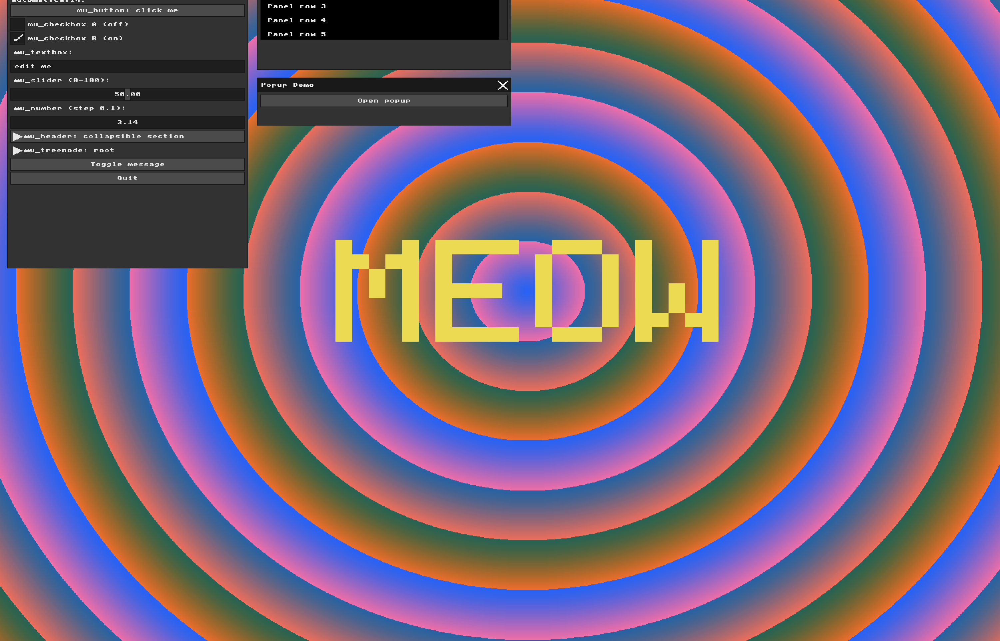

# Assignment: Basic Graphics and Immediate Mode GUI

## Overview

In this assignment, you will explore low-level computer graphics and Immediate Mode Graphical User Interfaces, and draw some lines and curves. You will manipulate a raw framebuffer to render graphics and modify a real-time rendering loop to understand how UI state is calculated and drawn independently of user input.

### Part 1: Manipulating the Framebuffer
##### Task

**My answer:** I changed the background to be in a pattern of concentric circles. 

```
for (int i = 0; i < WIDTH * HEIGHT; i++) {
  int x = i % WIDTH; #we find the coordinate of x of the pixel
  int y = i / WIDTH; #we find the coordinate of y of the pixel

  int dx = x - WIDTH / 2; #we find the distance of coordinate x from the x of the center
  int dy = y - HEIGHT / 2; #we find the distance of coordinate y from the y of the center

  int distance = (int)sqrt((double)(dx * dx + dy * dy)); #we use pythagorean theorem to find the distance from the center of the screen to this pixel

  uint8_t r = (uint8_t)((distance * 3) % 256); #we increase the red value each time the distance from center increases and when we go over maximum value (256) we start over
  uint8_t g = (uint8_t)(100); #green stays the same value
  uint8_t b = (uint8_t)((255 - distance) & 255); #we decrease the blue value each time the distance from center increases and when we go over maximum value (256) we start over

  g_buffer[i] = MFB_RGB(r, g, b);
}
```
We get the effect of circular red rings because the red value is `3*distance from centre` therefore each point in the same distance from centre receives the same red value therefore creating a circle, and then after repeating increases we pass the mark of 255 which is the highest possible value of red and it makes us return back to lower values which creates the illusion that the red ring ended.

We get the effect of the blue color in the inner part of the red rings because of the calculation of the value of blue which is `(255 - distance) & 255` this calculation makes the blue brighter in the beginning because the distance from center is small and therefore `255-distance` has a bigger value, unlike red that has technically a bigger value the farther it is from the center. And then the blue relapses because it gets out of bounds of 255 much like red.

We also have a green tint effect because each pixel has the same green value


### Part 2: Immediate Mode UI Declaration

**My answer:**
```
// custom interactive widget
      mu_layout_row(ctx, 1, w1, 0);

      if (mu_button(ctx, "Toggle message")) {
          show_message = !show_message;
          printf("Toggle message button clicked\n");
        }

      if (show_message) {
          mu_layout_row(ctx, 1, w1, 0);
          mu_label(ctx, "Hello World!!1");
        }
```


As the code suggests I added a button with the name "Toggle message" that has control over a "show_message" flag that updates to true once our new button has been pressed. When the program sees that the flag = true it prints "Hello World!!1" beneath.

### Part 3: The Real-Time Graphics Loop and Input Handling

**My answer:**
```
mfb_set_char_input_callback(
    [](struct mfb_window *w, unsigned int c) {
      extern void ui_bridge_char_input(struct mfb_window *, unsigned int);

      // C toggles MEOW mode and randomizes its color
      if (c == 'c' || c == 'C') {
        g_meow_mode = !g_meow_mode;

        g_meow_r = rand() % 256;
        g_meow_g = rand() % 256;
        g_meow_b = rand() % 256;

        printf("MEOW mode: %s\n", g_meow_mode ? "ON" : "OFF");

        return; // consume C
      }

      // Everything else still goes to the UI
      ui_bridge_char_input(w, c);
    },
    window);
```
This code adds the condition of if you press key 'c' or 'C' then the callback function changes the "meow effect" flag to be true if pressed once and false if pressed again and also randomizes the color for the pixel art in the effect by picking 3 random red, green and blue values.
```
if (g_meow_mode) {
  // 5x7 pixel-font patterns for M E O W
  const char *letters[4][7] = {
      {
          "10001",
          "11011",
          "10101",
          "10101",
          "10001",
          "10001",
          "10001"
      },
      {
          "11111",
          "10000",
          "10000",
          "11110",
          "10000",
          "10000",
          "11111"
      },
      {
          "01110",
          "10001",
          "10001",
          "10001",
          "10001",
          "10001",
          "01110"
      },
      {
          "10001",
          "10001",
          "10001",
          "10101",
          "10101",
          "11011",
          "10001"
      }
  };

  int pixelSize = 25;
  int letterWidth = 5 * pixelSize;
  int spacing = pixelSize;

  int totalWidth = 4 * letterWidth + 3 * spacing;

  int startX = (WIDTH - totalWidth) / 2;
  int startY = (HEIGHT - 7 * pixelSize) / 2;

  uint32_t meowColor =
      MFB_RGB(g_meow_r, g_meow_g, g_meow_b);

  for (int letter = 0; letter < 4; letter++) {

    for (int row = 0; row < 7; row++) {

      for (int col = 0; col < 5; col++) {

        if (letters[letter][row][col] == '1') {

          int blockX =
              startX + letter * (letterWidth + spacing)
              + col * pixelSize;

          int blockY =
              startY + row * pixelSize;

          // Draw one large "pixel"
          for (int py = 0; py < pixelSize; py++) {
            for (int px = 0; px < pixelSize; px++) {

              int x = blockX + px;
              int y = blockY + py;

              if (x >= 0 && x < WIDTH &&
                  y >= 0 && y < HEIGHT) {

                g_buffer[y * WIDTH + x] = meowColor;
              }
            }
          }
        }
      }
    }
  }
}
```
In this code we create the pixel art of the world "meow" on the background 



### Part 4: UI Architecture & The Renderer Bridge

**My answer:**
```
void UIRenderer::draw_rect(mu_Rect rect, mu_Color color) {
    uint32_t c = to_uint32(color);
    int x1 = std::max({rect.x, m_clip_rect.x, 0});
    int y1 = std::max({rect.y, m_clip_rect.y, 0});
    int x2 = std::min({rect.x + rect.w, m_clip_rect.x + m_clip_rect.w, m_width});
    int y2 = std::min({rect.y + rect.h, m_clip_rect.y + m_clip_rect.h, m_height});

    for (int y = y1; y < y2; y++) {
        for (int x = x1; x < x2; x++) {

        // Visual transformation:
        // Shift rectangle pixels 200 pixels DOWN.
            int shifted_y = y + 200;

            if (shifted_y >= 0 && shifted_y < m_height) {
                m_buffer[shifted_y * m_width + x] = c;
        }
    }
}
}
```

In this code I took the original draw rect from the ui renderer and altered it only by shifting the all of the y coordinates down by 200, which made all of the rectangles that held the text before drop down so it doesn't match anymore with the text as we can see in the picture.
This changes only the visual representation of the UI. MicroUI's internal layout and input coordinates remain unchanged. As a result, the visible button is drawn 200 pixels to the down of its logical hitbox.
Therefore clicking directly on the shifted visual representation will not correspond to the button's original interaction area that isn't controlled by the renderer. 
To press the button, the mouse cursor has to be at the original place of the button, which is 200 pixels upwards from the rectangles or since we didn't switch the position of the text yet, right on the text since it remains at it's original place.

---

### Part 5: Binding UI to Application State

**My answer:** I added 2 new sliders to the program that control the background from part 1. The first slider controls the ring density in the background and the second slider controls the blue level of the background.

To do so I first added 2 corresponding static variables outside the main loop so the sliders could take pointers to them.

Ring_density starts at 3.0, which is the same multiplier that I originally used for the red component of my background. blue_level starts at 255.0, which corresponds to the original starting blue value.

```
// Part 5: application state controlled by UI
static float ring_density = 3.0f;
static float blue_level = 255.0f;
```

Then I altered the background loop so the values there would depend on the sliders values:

```
while (mfb_update_events(window) != MFB_STATE_EXIT) {
    // Input
    ui_bridge_input(ctx, window);

    // Scene Rendering (Background)
    for (int i = 0; i < WIDTH * HEIGHT; i++) {
      int x = i % WIDTH;
      int y = i / WIDTH;

      int dx = x - WIDTH / 2;
      int dy = y - HEIGHT / 2;

      int distance = (int)sqrt((double)(dx * dx + dy * dy));

      uint8_t r = (uint8_t)(((int)(distance * ring_density)) % 256);
      uint8_t g = (uint8_t)(100);
      uint8_t b = (uint8_t)(((int)blue_level - distance) & 255);
      g_buffer[i] = MFB_RGB(r, g, b);
  }

```
The calculation of distance is still the same as in Part 1. For every pixel, I calculate its distance from the centre of the screen. Pixels at the same distance from the centre receive the same calculated color values, which produces the concentric circular pattern.

The important difference is that the red calculation now uses: distance * ring_density
instead of the original fixed calculation: distance * 3

So now changing ring_density changes how quickly the red value increases as the distance from the centre increases. With a smaller ring_density, the color changes more slowly and the rings become wider. With a larger value, the red component cycles through its range more quickly, producing more densely packed rings.

The blue calculation was also changed from a fixed starting value of 255 to the variable blue_level: (uint8_t)(((int)blue_level - distance) & 255)

Because of that now the user can change the starting blue component interactively. Moving the Blue Level slider changes the amount and distribution of blue in the background.

And of course I constructed the sliders themselves as the example slider was made in main.cpp:

```
// sliders for part 5
      mu_layout_row(ctx, 1, w1, 0);
      mu_label(ctx, "Ring Density:");//name of slider
      mu_slider(ctx, &ring_density, 1.0f, 10.0f);//pointer to external variable 

      mu_layout_row(ctx, 1, w1, 0);
      mu_label(ctx, "Blue Level:");// name of slider
      mu_slider(ctx, &blue_level, 0.0f, 255.0f);//pointer to external variable
```

### Part 6: Interactive Line Drawing App

##### Background: Implementing the Algorithm
In class, we discussed the theory behind **Bresenham's Line Algorithm** and how it elegantly approximates a straight line on a discrete pixel grid using only fast integer math. Now, it is time to translate that theory into a working renderer.

As you recall, calculating lines that go in any arbitrary direction means handling all eight possible octants (e.g., steep slopes vs. shallow slopes, drawing left-to-right vs. right-to-left). This can quickly lead to a messy explosion of `if-else` statements and redundant code. Your code should adhere to the *DRY* principle.

##### Task: Write the Line Function
**My answer:**
Below is my code for the line algorithm:
```
void draw_line(int x0, int y0, int x1, int y1, uint32_t color) {

    int dx = abs(x1 - x0); //distance between x0 and x1
    int sx = x0 < x1 ? 1 : -1;//direction of the line on x, if 1 the line goes to the right, else to left

    int dy = -abs(y1 - y0);//distance between y0 and y1
    int sy = y0 < y1 ? 1 : -1;//direction of the line on y, if 1 the line goes up, else down

    int error = dx + dy;

    while (true) {

        if (x0 >= 0 && x0 < WIDTH && y0 >= 0 && y0 < HEIGHT) { //if x0 and y0 are in board range

            g_buffer[y0 * WIDTH + x0] = color; //we place the color we want on the forst coordinate of the line
        }

        if (x0 == x1 && y0 == y1)//we stop if the line is a dot
            break;

        int e2 = 2 * error;

        if (e2 >= dy) {//if the error from the ideal line is bigger than distanse of y, we should move on x
            error += dy;
            x0 += sx;// move line left or right according to coordinates
        }

        if (e2 <= dx) {//if the error from the ideal line is smaller than distanse of x, we should move on y
            error += dx;
            y0 += sy;// move line up or down according to coordinates
        }
    }
}
```
This function first measures the distance between the two coordinates given. Then we calculate the error value by adding up the distances, later on we use double the error to decide whether the algorithm should move in the x direction, the y direction, or both and after each movement we of course update the error. Additionally there are of course ifs for edge cases.

And here are the hard coded test commands to check if it works properly:
```
draw_line(600, 450, 1200, 650, MFB_RGB(255, 0, 0));     // shallow down-right
draw_line(800, 350, 1000, 950, MFB_RGB(0, 255, 0));     // steep down-right
draw_line(1200, 400, 600, 750, MFB_RGB(0, 0, 255));     // right-to-left
draw_line(1100, 900, 650, 400, MFB_RGB(255, 255, 0));   // up-left
```
As you can see in the following picture the lines are drawn in an appropriate way.


##### Task: AI-Assisted UX Planning
Now, you must bridge the Immediate Mode UI concepts from Parts 2-5 with your new `draw_line` function to create an interactive drawing tool. But before you write the code, you need to design the interaction. 

**Use an AI assistant to brainstorm the User Experience (UX) for drawing.** Prompt the AI to discuss the pros, cons, and logic of different ways a user might draw a line with a mouse. 
*   Does the user click once to set the start point, and click again to set the end point? 
*   Do they click and hold, drag the mouse, and release to finalize the line? 
*   If they drag, how do you manage the "state" so the line is previewed but not permanently drawn until the mouse is released?

Reason through these approaches, choose the one you think makes the best application, and implement it using MicroUI's input and mouse state variables.

##### Task: The Creative Canvas
Combine everything you have built into a useful, interactive tool. The baseline requirement is that the user can interactively draw multiple permanent lines onto the screen. 

However, you are highly encouraged to push the limits of your architecture. An ambitious implementation might feature:
*   A UI panel with sliders to control the RGB values of the current line.
*   A "Clear Screen" button.
*   An automated "spirograph" mode that draws algorithmic lines based on UI slider parameters.
*   Logic to handle drawing continuous, connected lines (a brush tool).

Design an interface and visual result that you are proud of!
