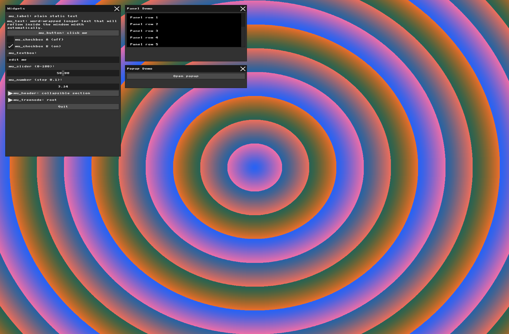
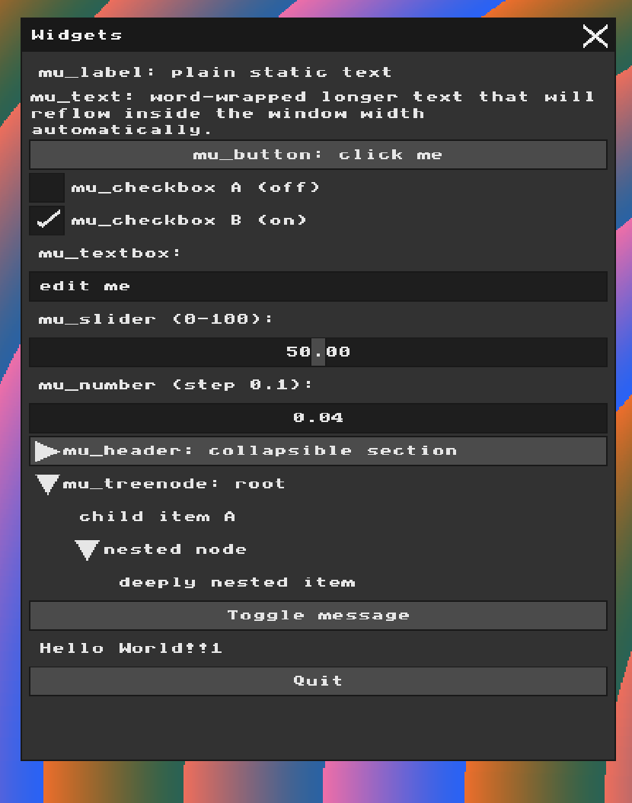
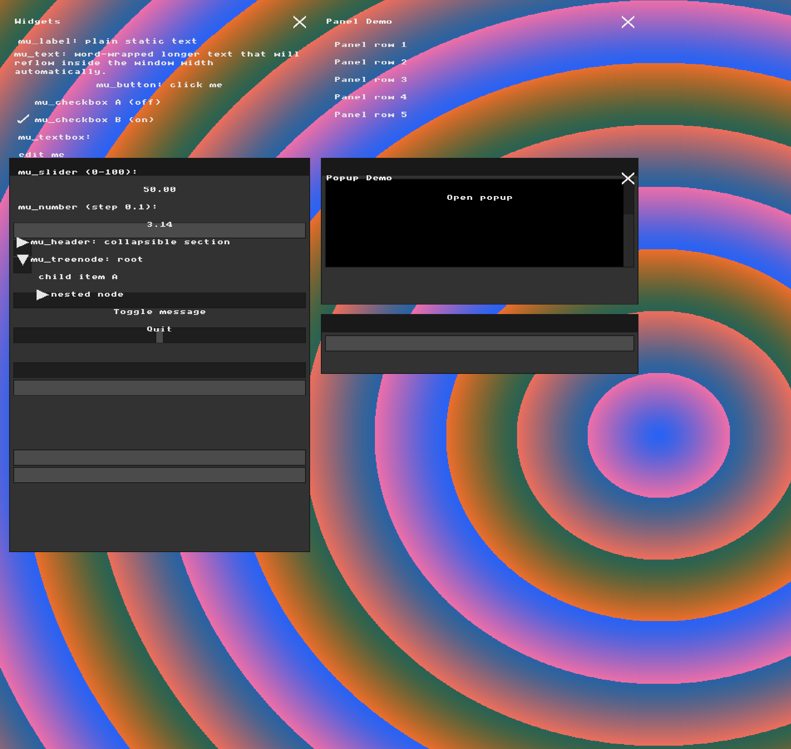
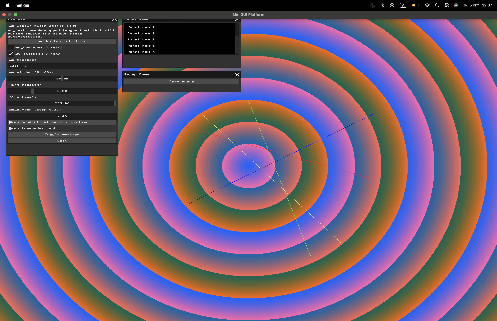

# Assignment: Basic Graphics and Immediate Mode GUI

## Overview

In this assignment, you will explore low-level computer graphics and Immediate Mode Graphical User Interfaces, and draw some lines and curves. You will manipulate a raw framebuffer to render graphics and modify a real-time rendering loop to understand how UI state is calculated and drawn independently of user input.

### Part 1: Manipulating the Framebuffer

##### Task 1

**My answer:** I changed the background to be in a pattern of concentric circles.

```cpp
for (int i = 0; i < WIDTH * HEIGHT; i++) {
  int x = i % WIDTH; // We find the x coordinate of the pixel
  int y = i / WIDTH; // We find the y coordinate of the pixel

  int dx = x - WIDTH / 2; // We find the distance of coordinate x from the x coordinate of the center
  int dy = y - HEIGHT / 2; // We find the distance of coordinate y from the y coordinate of the center

  int distance = (int)sqrt((double)(dx * dx + dy * dy)); // We use the Pythagorean theorem to find the distance from the center of the screen to this pixel

  uint8_t r = (uint8_t)((distance * 3) % 256); // We increase the red value each time the distance from the center increases, and when we go over the maximum value (256), we start over
  uint8_t g = (uint8_t)(100); // Green stays the same value
  uint8_t b = (uint8_t)((255 - distance) & 255); // We decrease the blue value each time the distance from the center increases, and when we go over the maximum value (256), we start over

  g_buffer[i] = MFB_RGB(r, g, b);
}
```

We get the effect of circular red rings because the red value is `3 * distance from centre`. Therefore, each point at the same distance from the centre receives the same red value, creating a circle. Then, after repeated increases, we pass the mark of 255, which is the highest possible value of red, and it makes us return back to lower values, which creates the illusion that the red ring ended.

We get the effect of the blue color in the inner part of the red rings because of the calculation of the value of blue, which is `(255 - distance) & 255`. This calculation makes the blue brighter in the beginning because the distance from the center is small, and therefore `255 - distance` has a bigger value, unlike red, which technically has a bigger value the farther it is from the center. Then the blue relapses because it gets out of the bounds of 255, much like red.

We also have a green tint effect because each pixel has the same green value.



### Part 2: Immediate Mode UI Declaration

##### Task 2

**My answer:**

```cpp
// Custom interactive widget
mu_layout_row(ctx, 1, w1, 0);

if (mu_button(ctx, "Toggle message")) {
    show_message = !show_message;
    printf("Toggle message button clicked\n");
}

if (show_message) {
    mu_layout_row(ctx, 1, w1, 0);
    mu_label(ctx, "Hello World!!1");
}
```



As the code suggests, I added a button with the name "Toggle message" that has control over a `show_message` flag that updates to true once our new button has been pressed. When the program sees that the flag = true, it prints "Hello World!!1" beneath.

### Part 3: The Real-Time Graphics Loop and Input Handling

##### Task 3

**My answer:**

```cpp
mfb_set_char_input_callback(
    [](struct mfb_window *w, unsigned int c) {
      extern void ui_bridge_char_input(struct mfb_window *, unsigned int);

      // C toggles MEOW mode and randomizes its color
      if (c == 'c' || c == 'C') {
        g_meow_mode = !g_meow_mode;

        g_meow_r = rand() % 256;
        g_meow_g = rand() % 256;
        g_meow_b = rand() % 256;

        printf("MEOW mode: %s\n", g_meow_mode ? "ON" : "OFF");

        return; // Consume C
      }

      // Everything else still goes to the UI
      ui_bridge_char_input(w, c);
    },
    window);
```

This code adds the condition that if you press the key `c` or `C`, then the callback function changes the "meow effect" flag to be true if pressed once and false if pressed again. It also randomizes the color for the pixel art in the effect by picking three random red, green, and blue values.

```cpp
if (g_meow_mode) {
  // 5x7 pixel-font patterns for M E O W
  const char *letters[4][7] = {
      {
          "10001",
          "11011",
          "10101",
          "10101",
          "10001",
          "10001",
          "10001"
      },
      {
          "11111",
          "10000",
          "10000",
          "11110",
          "10000",
          "10000",
          "11111"
      },
      {
          "01110",
          "10001",
          "10001",
          "10001",
          "10001",
          "10001",
          "01110"
      },
      {
          "10001",
          "10001",
          "10001",
          "10101",
          "10101",
          "11011",
          "10001"
      }
  };

  int pixelSize = 25;
  int letterWidth = 5 * pixelSize;
  int spacing = pixelSize;

  int totalWidth = 4 * letterWidth + 3 * spacing;

  int startX = (WIDTH - totalWidth) / 2;
  int startY = (HEIGHT - 7 * pixelSize) / 2;

  uint32_t meowColor =
      MFB_RGB(g_meow_r, g_meow_g, g_meow_b);

  for (int letter = 0; letter < 4; letter++) {

    for (int row = 0; row < 7; row++) {

      for (int col = 0; col < 5; col++) {

        if (letters[letter][row][col] == '1') {

          int blockX =
              startX + letter * (letterWidth + spacing)
              + col * pixelSize;

          int blockY =
              startY + row * pixelSize;

          // Draw one large "pixel"
          for (int py = 0; py < pixelSize; py++) {
            for (int px = 0; px < pixelSize; px++) {

              int x = blockX + px;
              int y = blockY + py;

              if (x >= 0 && x < WIDTH &&
                  y >= 0 && y < HEIGHT) {

                g_buffer[y * WIDTH + x] = meowColor;
              }
            }
          }
        }
      }
    }
  }
}
```

In this code, we create the pixel art of the word "MEOW" on the background.

**Demo: MEOW Keyboard Effect**
https://github.com/user-attachments/assets/14db284e-e3e1-4aec-8219-f49144f43b4b

### Part 4: UI Architecture & The Renderer Bridge

##### Task 4:

**My answer:**

```cpp
void UIRenderer::draw_rect(mu_Rect rect, mu_Color color) {
    uint32_t c = to_uint32(color);
    int x1 = std::max({rect.x, m_clip_rect.x, 0});
    int y1 = std::max({rect.y, m_clip_rect.y, 0});
    int x2 = std::min({rect.x + rect.w, m_clip_rect.x + m_clip_rect.w, m_width});
    int y2 = std::min({rect.y + rect.h, m_clip_rect.y + m_clip_rect.h, m_height});

    for (int y = y1; y < y2; y++) {
        for (int x = x1; x < x2; x++) {

            // Visual transformation:
            // Shift rectangle pixels 200 pixels DOWN.
            int shifted_y = y + 200;

            if (shifted_y >= 0 && shifted_y < m_height) {
                m_buffer[shifted_y * m_width + x] = c;
            }
        }
    }
}
```

In this code, I took the original `draw_rect` from the UI renderer and altered it only by shifting all of the y coordinates down by 200, which made all of the rectangles that held the text before drop down, so they don't match anymore with the text, as we can see in the picture.

This changes only the visual representation of the UI. MicroUI's internal layout and input coordinates remain unchanged. As a result, the visible button is drawn 200 pixels below its logical hitbox.

Therefore, clicking directly on the shifted visual representation will not correspond to the button's original interaction area, which isn't controlled by the renderer.

To press the button, the mouse cursor has to be at the original place of the button, which is 200 pixels upwards from the rectangles, or, since we didn't switch the position of the text, right on the text, since it remains at its original place.



---

### Part 5: Binding UI to Application State

##### Task 5

**My answer:** I added 2 new sliders to the program that control the background from Part 1. The first slider controls the ring density in the background, and the second slider controls the blue level of the background.

To do so, I first added 2 corresponding static variables outside the main loop so the sliders could take pointers to them.

`ring_density` starts at 3.0, which is the same multiplier that I originally used for the red component of my background. `blue_level` starts at 255.0, which corresponds to the original starting blue value.

```cpp
// Part 5: application state controlled by UI
static float ring_density = 3.0f;
static float blue_level = 255.0f;
```

Then I altered the background loop so the values there would depend on the sliders' values:

```cpp
while (mfb_update_events(window) != MFB_STATE_EXIT) {
    // Input
    ui_bridge_input(ctx, window);

    // Scene Rendering (Background)
    for (int i = 0; i < WIDTH * HEIGHT; i++) {
      int x = i % WIDTH;
      int y = i / WIDTH;

      int dx = x - WIDTH / 2;
      int dy = y - HEIGHT / 2;

      int distance = (int)sqrt((double)(dx * dx + dy * dy));

      uint8_t r = (uint8_t)(((int)(distance * ring_density)) % 256);
      uint8_t g = (uint8_t)(100);
      uint8_t b = (uint8_t)(((int)blue_level - distance) & 255);
      g_buffer[i] = MFB_RGB(r, g, b);
    }
```

The calculation of distance is still the same as in Part 1. For every pixel, I calculate its distance from the centre of the screen. Pixels at the same distance from the centre receive the same calculated color values, which produces the concentric circular pattern.

The important difference is that the red calculation now uses: `distance * ring_density`

instead of the original fixed calculation: `distance * 3`

So now changing `ring_density` changes how quickly the red value increases as the distance from the centre increases. With a smaller `ring_density`, the color changes more slowly and the rings become wider. With a larger value, the red component cycles through its range more quickly, producing more densely packed rings.

The blue calculation was also changed from a fixed starting value of 255 to the variable `blue_level`: `(uint8_t)(((int)blue_level - distance) & 255)`

Because of that, now the user can change the starting blue component interactively. Moving the Blue Level slider changes the amount and distribution of blue in the background.

And of course, I constructed the sliders themselves as the example slider was made in `main.cpp`:

```cpp
// Sliders for Part 5
mu_layout_row(ctx, 1, w1, 0);
mu_label(ctx, "Ring Density:"); // Name of slider
mu_slider(ctx, &ring_density, 1.0f, 10.0f); // Pointer to external variable

mu_layout_row(ctx, 1, w1, 0);
mu_label(ctx, "Blue Level:"); // Name of slider
mu_slider(ctx, &blue_level, 0.0f, 255.0f); // Pointer to external variable
```

https://github.com/user-attachments/assets/a4279272-bb1d-43bf-b85e-3e24bdfb80c3

### Part 6: Interactive Line Drawing App

##### Task 6: Write the Line Function

**My answer:**

Below is my code for the line algorithm:

```cpp
void draw_line(int x0, int y0, int x1, int y1, uint32_t color) {

    int dx = abs(x1 - x0); // Distance between x0 and x1
    int sx = x0 < x1 ? 1 : -1; // Direction of the line on x: if 1, the line goes to the right, else to the left

    int dy = -abs(y1 - y0); // Distance between y0 and y1
    int sy = y0 < y1 ? 1 : -1; // Direction of the line on y: if 1, the line goes up, else down

    int error = dx + dy;

    while (true) {

        if (x0 >= 0 && x0 < WIDTH && y0 >= 0 && y0 < HEIGHT) { // If x0 and y0 are in board range

            g_buffer[y0 * WIDTH + x0] = color; // We place the color we want on the first coordinate of the line
        }

        if (x0 == x1 && y0 == y1) // We stop if the line is a dot
            break;

        int e2 = 2 * error;

        if (e2 >= dy) { // If the error from the ideal line is bigger than the distance of y, we should move on x
            error += dy;
            x0 += sx; // Move line left or right according to coordinates
        }

        if (e2 <= dx) { // If the error from the ideal line is smaller than the distance of x, we should move on y
            error += dx;
            y0 += sy; // Move line up or down according to coordinates
        }
    }
}
```

This function first measures the distance between the two coordinates given. Then we calculate the error value by adding up the distances. Later on, we use double the error to decide whether the algorithm should move in the x direction, the y direction, or both, and after each movement we, of course, update the error. Additionally, there are, of course, `if` statements for edge cases.

And here are the hard-coded test commands to check if it works properly:

```cpp
draw_line(600, 450, 1200, 650, MFB_RGB(255, 0, 0));
draw_line(800, 350, 1000, 950, MFB_RGB(0, 255, 0));
draw_line(1200, 400, 600, 750, MFB_RGB(0, 0, 255));
draw_line(1100, 900, 650, 400, MFB_RGB(255, 255, 0));
```

As you can see in the following picture, the lines are drawn in an appropriate way.



##### Task 7: AI-Assisted UX Planning

**My answer:**

There are 2 main options for the possible UX planning for the line drawing algorithm.

The first and easier-to-implement version is a two-click system where the user makes two clicks on the screen where they want the two edges of the line to go. The obvious advantage of this method is that it is simple to implement because the program mainly needs to remember whether the first point has already been selected. But the main con of this implementation is that it is an unnatural drawing implementation compared to regular canvas apps that use the dragging-like brush method for drawing.

The second option was a click-drag-release system. The user presses the mouse button to establish the starting point, holds the button while moving the mouse to choose the endpoint, and releases the button to finalize the line. The con here is that it requires more application state, but the advantage of this method is that it behaves more like your normal drawing tools and allows the user to see the result before committing to it.

Because of the second option's similarity to regular drawing tools and its more friendly user experience, I chose it as our UX plan.

To implement this, the application needs to know whether we are actively drawing or not, and for that we will use state variables that remember whether a line is currently being drawn, where it started, and where the mouse currently is:

```cpp
bool drawing = false; // Drawing or not flag

int start_x; // Start x coordinate
int start_y; // Start y coordinate

int current_x; // Current mouse position x
int current_y; // Current mouse position y
```

When the mouse button is initially pressed, its coordinates are copied into `start_x` and `start_y`, and `drawing` becomes true. While the button remains pressed, `current_x` and `current_y` follow the mouse. The program can then call `draw_line()` using the stored starting point and the current mouse position:

```cpp
if (drawing) {
    draw_line(start_x, start_y, current_x, current_y, preview_color);
}
```

This code generates only a **preview** line and not the actual end result, since we haven't released the mouse yet. Since the framebuffer is regenerated every frame, the old preview disappears and a new preview is drawn using the latest mouse coordinates.

When the mouse button is released, the final start and end coordinates are stored as a permanent line. The `drawing` variable is then set back to false.

For more practicality, we are also adding a new structure to the code, the `Line` struct:

```cpp
struct Line {
    int x0;
    int y0;
    int x1;
    int y1;
    uint32_t color;
};
```

Here are the new code parts that I added to draw the preview and final lines and interact with the mouse:

```cpp
// Part 6: interactive line drawing

current_x = ctx->mouse_pos.x;
current_y = ctx->mouse_pos.y;

// Mouse was just pressed
if ((ctx->mouse_pressed & MU_MOUSE_LEFT) && !drawing) {
    start_x = ctx->mouse_pos.x;
    start_y = ctx->mouse_pos.y;

    current_x = start_x;
    current_y = start_y;

    drawing = true;
}

// Mouse was released
if (drawing &&
    !(ctx->mouse_down & MU_MOUSE_LEFT)) {

    lines.push_back({
        start_x,
        start_y,
        current_x,
        current_y,
        MFB_RGB(255, 255, 255)
    });

    drawing = false;
}
```

```cpp
// Draw all completed lines
for (const Line& line : lines) {
    draw_line(
        line.x0,
        line.y0,
        line.x1,
        line.y1,
        line.color
    );
}
```

```cpp
// Draw temporary preview while dragging
if (drawing) {
    draw_line(
        start_x,
        start_y,
        current_x,
        current_y,
        MFB_RGB(255, 255, 255)
    );
}
```

As we can see, everything here works according to our previously described idea.

Below is a video that shows that the code indeed works:

**Demo: Interactive Line Drawing**
https://github.com/user-attachments/assets/079a59bf-5b67-4984-bfe1-2fb0c8ac6c43

##### Task: The Creative Canvas

**My answer:**

From the previous task, we already have all of the baseline requirements, but in this task I will still implement the following things:

- RGB sliders for drawing (similar to those implemented for the background)
- "Clear Screen" button
- "Undo" button
- Adding line thickness
- Adding a "Brush" tool

We will start by adding the RGB sliders. For that, we first need to add 3 state variables for 3 of the sliders:

```cpp
static float line_r = 255.0f;
static float line_g = 255.0f;
static float line_b = 255.0f;
```

After establishing the variables, I changed the color of new lines to be the color made from the sliders instead of the set color that it was before. For example, in `lines.push_back`, the `MFB_RGB(255, 255, 255)` that previously was the set color for every line changed to `current_color`, which I defined as:

```cpp
uint32_t current_color = MFB_RGB(
    (uint8_t)line_r,
    (uint8_t)line_g,
    (uint8_t)line_b
);
```

And then the sliders were added immediately after, similar to sliders that we implemented previously:

```cpp
mu_layout_row(ctx, 1, w1, 0);
mu_label(ctx, "Line Red:");
mu_slider(ctx, &line_r, 0.0f, 255.0f);

mu_layout_row(ctx, 1, w1, 0);
mu_label(ctx, "Line Green:");
mu_slider(ctx, &line_g, 0.0f, 255.0f);

mu_layout_row(ctx, 1, w1, 0);
mu_label(ctx, "Line Blue:");
mu_slider(ctx, &line_b, 0.0f, 255.0f);
```

Now we jump to the second and the third conditions that we wanted to fulfill:

The "Clear Screen" and "Undo" buttons operate relatively similarly because we originally store all of our lines in a vector. That means that all we need to do to erase all of the lines is simply to clear that vector, which is a known vector function. And for "Undo", we need to pop the latest line from the vector, which is also an existing function for vectors. Hooray!

```cpp
// Quit button
mu_layout_row(ctx, 1, w1, 0);
if (mu_button(ctx, "Quit")) {
    quit_requested = true;
}

mu_end_window(ctx);

// Clear Screen button
mu_layout_row(ctx, 1, w1, 0);

if (mu_button(ctx, "Clear Screen")) {
    lines.clear(); // Erasing the whole vector lines
}

// Undo button
mu_layout_row(ctx, 1, w1, 0);

if (mu_button(ctx, "Undo")) {
    if (!lines.empty()) {
        lines.pop_back(); // Popping the last line
    }
}
```

Now, for adding thickness for the brush, the process is similar to adding the sliders and static variables and adding the thickness parameter to every line occurrence. The only difference to keep an eye on is the difference in the `draw_line` function:

```cpp
// Draw multiple pixels around the Bresenham point
// to give the line thickness.
int radius = thickness / 2;

for (int offset_y = -radius; offset_y <= radius; offset_y++) {
    for (int offset_x = -radius; offset_x <= radius; offset_x++) {

        int px = x0 + offset_x;
        int py = y0 + offset_y;

        if (px >= 0 && px < WIDTH && py >= 0 && py < HEIGHT) {

            g_buffer[py * WIDTH + px] = color;
        }
    }
}
```

Bresenham's algorithm normally calculates a single pixel for each step of the line, producing a one-pixel-wide result. So, to support variable line thickness, I kept the Bresenham algorithm unchanged but replaced each individual pixel with a square group of pixels centered around the calculated `(x0, y0)` coordinate. Two nested loops generate X and Y offsets from `-radius` to `+radius`, and these offsets are added to the Bresenham coordinate to obtain the neighboring pixels. Before writing each pixel to `g_buffer`, I check that its coordinates remain inside the framebuffer. As Bresenham advances along the line, these groups of pixels overlap and visually form a continuous thick line.

### Brush Mode

As an additional feature for the Creative Canvas, I added a **Brush Mode** that allows the user to draw freehand instead of only creating straight lines between two points.

The main idea is to reuse the Bresenham `draw_line()` function that I had already implemented. Instead of developing a completely different drawing algorithm for the brush, the program divides the mouse movement into many small line segments and uses Bresenham's algorithm to connect them.

First, I added several application state variables:

```cpp
static int brush_enabled = 0;
static bool brushing = false;

static int brush_prev_x = 0;
static int brush_prev_y = 0;
```

`brush_enabled` stores whether Brush Mode is selected. It is an `int` rather than a `bool` because MicroUI's `mu_checkbox()` expects a pointer to an integer:

```cpp
mu_checkbox(ctx, "Brush Mode", &brush_enabled);
```

A value of `0` means that Brush Mode is disabled, while a non-zero value means that it is enabled.

The `brushing` variable has a different purpose. It stores whether the user is currently in the middle of drawing a brush stroke. Finally, `brush_prev_x` and `brush_prev_y` remember the previous mouse position so that it can be connected to the next mouse position.

When Brush Mode is enabled and the left mouse button is first pressed inside the canvas, I start a new brush stroke:

```cpp
if (brush_enabled && mouse_on_canvas &&
    (ctx->mouse_pressed & MU_MOUSE_LEFT)) {

    brushing = true;

    brush_prev_x = ctx->mouse_pos.x;
    brush_prev_y = ctx->mouse_pos.y;
}
```

At this point, no line segment needs to be created yet. The program only remembers the starting mouse coordinates.

While the user continues holding the left mouse button, the program reads the new mouse position:

```cpp
if (brush_enabled && brushing &&
    (ctx->mouse_down & MU_MOUSE_LEFT)) {

    int brush_x = ctx->mouse_pos.x;
    int brush_y = ctx->mouse_pos.y;
```

The new coordinates are compared with the previous coordinates. If the mouse has actually moved, I create a short line between the previous and current positions:

```cpp
if (brush_x != brush_prev_x ||
    brush_y != brush_prev_y) {

    lines.push_back({
        brush_prev_x,
        brush_prev_y,
        brush_x,
        brush_y,
        current_color,
        (int)line_thickness
    });

    brush_prev_x = brush_x;
    brush_prev_y = brush_y;
}
```

Because these segments share endpoints, they visually join together and appear as one continuous freehand stroke.

Each small segment is stored in the existing `lines` vector together with the currently selected color and thickness:

```cpp
current_color,
(int)line_thickness
```

This means the RGB sliders and Line Thickness slider automatically work with Brush Mode as well. I did not need separate color or thickness systems for the brush.

When the user releases the mouse button, the brush stroke is stopped:

```cpp
if (brushing &&
    !(ctx->mouse_down & MU_MOUSE_LEFT)) {

    brushing = false;
}
```

I also separated the two drawing modes using `brush_enabled`. When Brush Mode is disabled, the original click-drag-release straight-line tool is used. When Brush Mode is enabled, mouse movement creates the connected brush segments instead. This prevents both drawing tools from reacting to the same mouse input simultaneously.

**Demo: Freehand Brush Mode**
https://github.com/user-attachments/assets/e0cd5f40-896d-4b2b-8963-54636ffcd049
