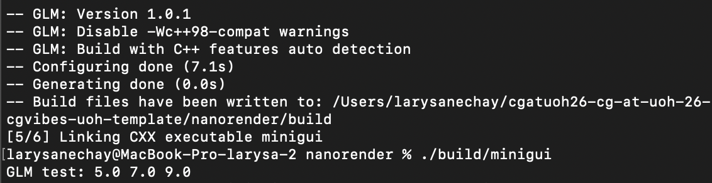
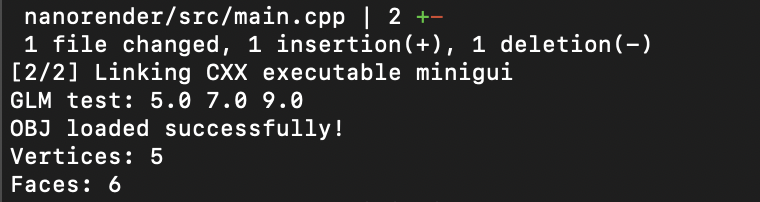
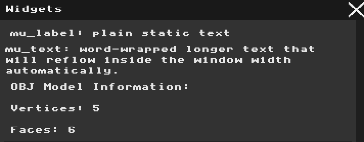
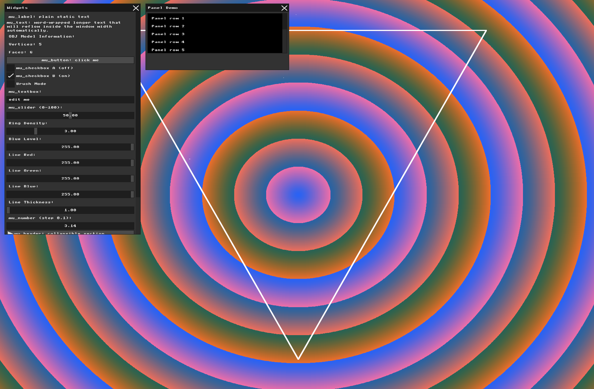

# Assignment: Wireframe Viewer and Geometric Transformations

## Overview

In this assignment, you will transition from drawing 2D pixels to manipulating 3D geometry. You will load a 3D mesh into memory, project its vertices onto your 2D screen, and draw it using the line-drawing algorithm you built in Assignment 1. Finally, you will implement mathematical transformations (scaling, rotation, and translation) and wire them up to your Immediate Mode GUI to manipulate the 3D object in real-time.

### Part 0: Introduction to GLM

##### Task 0

**My Answer:**
Here are the verifications that the gel was inserted properly:

```
// Part 0: Simple GLM test
glm::vec3 a(1.0f, 2.0f, 3.0f);
glm::vec3 b(4.0f, 5.0f, 6.0f);

glm::vec3 result = a + b;

printf("GLM test: %.1f %.1f %.1f\n",
       result.x, result.y, result.z);
```
Confirmation of compiling and the example properly working in terminal:



### Part 1: Loading and Inspecting 3D Data

##### Task 1

**My Answer:**

Write a function that loads an `.obj` file. To check your code, create an `.obj` file that contains an object with up to 10 vertices and faces, load it, and display the number of faces and vertices in the GUI and see if it matches the content of the file. You may display more information as seem necessary.

This section is the loader test via terminal, after the terminal test runs smoothly I will show off the results in the GUI:

Load object function:
```
struct Face {
    int v0;//vertexes
    int v1;
    int v2;
};

std::vector<glm::vec3> vertices;
std::vector<Face> faces;

bool load_obj(const std::string& filename, std::vector<glm::vec3>& vertices, std::vector<Face>& faces) {//receives the //name of the file, vector of vertices and vector of faces

    std::ifstream file(filename);//reads data from the file that we are trying to load

    if (!file.is_open()) {//if ifstream can't open the file we print an error message
        printf("Could not open OBJ file: %s\n", filename.c_str());
        return false;
    }

    std::string line;

    while (std::getline(file, line)) {//reading the file line by line

        std::stringstream ss(line);//devides the line to pieces so we can process each part separately
        std::string type;//stores the first part of the line which is the type 

        ss >> type;// moves to the next part of the line

        // Vertex line: v x y z
        if (type == "v") {//if it is a vertex line

            float x, y, z;
            ss >> x >> y >> z;//the next 3 parts of the line are x y z coordinates

            vertices.push_back(glm::vec3(x, y, z));//we store the vertex that we discovered in vertex vector
        }

        // Face line: f v1 v2 v3
        else if (type == "f") {//if it is a face line

            int a, b, c;
            ss >> a >> b >> c;//same as we did with vertexes

            // OBJ numbering starts from 1,
            // but C++ vectors start from 0.
            faces.push_back({a - 1, b - 1, c - 1});//we store the new faces in faces vector
        }
    }

    return true;
}
```
This function read every line in the file and if it starts with 'v' it is a vertex description so it stores the x y z coordinates in it, and if it starts with 'f' it is a face description so we store all of the faces in it. If the file can't be read the function returns false and a message.

test code:
```
bool obj_loaded = load_obj("assets/test.obj", vertices, faces);//true if the file has been read //else false

if (obj_loaded) {//if the file was read successfully prints the following messages
    printf("OBJ loaded successfully!\n");
    printf("Vertices: %zu\n", vertices.size());
    printf("Faces: %zu\n", faces.size());
}
```
This test code prints "OBJ loaded successfully! Vertices: "num_of vertices" Faces: "num_of_faces"" (in terminal)

test obj:
```
v -1.0 0.0 -1.0
v  1.0 0.0 -1.0
v  1.0 0.0  1.0
v -1.0 0.0  1.0
v  0.0 2.0  0.0

f 1 2 5
f 2 3 5
f 3 4 5
f 4 1 5
f 1 2 3
f 1 3 4
```
terminal results:



As we can see in the terminal there are 5 vertices and 6 faces just like in the object file, which means everything works successfully!

Now all that's left is to display this information in the GUI by adding new widgets:

```
// OBJ model information
      mu_layout_row(ctx, 1, w1, 0);
      mu_label(ctx, "OBJ Model Information:");

      char vertex_text[64];
      snprintf(vertex_text, sizeof(vertex_text),"Vertices: %zu", vertices.size());
      mu_label(ctx, vertex_text);

      char face_text[64];
      snprintf(face_text, sizeof(face_text),"Faces: %zu", faces.size());
      mu_label(ctx, face_text);
```
result:




### Part 2: Normalization and the Viewport Transform

##### Task 2

**My answer:**

Firstly to complete the task I started out with making the 'find_bounding_box' function, and additionally making a structure to contain the maximum and minimum of the bounding box for easy use in the future.
```
struct BoundingBox {
    glm::vec3 min;
    glm::vec3 max;
};

BoundingBox find_bounding_box(const std::vector<glm::vec3>& vertices) {

    BoundingBox box;

    box.min = vertices[0];
    box.max = vertices[0];

    // Compare every vertex with the current min and max
    for (const glm::vec3& vertex : vertices) {

        box.min.x = std::min(box.min.x, vertex.x);
        box.min.y = std::min(box.min.y, vertex.y);
        box.min.z = std::min(box.min.z, vertex.z);

        box.max.x = std::max(box.max.x, vertex.x);
        box.max.y = std::max(box.max.y, vertex.y);
        box.max.z = std::max(box.max.z, vertex.z);
    }

    return box;
}
```
This function is pretty straight forward, all we do is run over all of the vertexes in the file and find the minimum and maximum between them, by comparing each coordinate to the current minimum coordinate in either x, y or z scale. Therefore our structure contains two vertexes, one with the minimal values of x, y and z, and one with the maximum values.

Next part is scaling and translation, I added it right after the load file check.
This code specifically doesn't change the vertexes yet, all we do here is calculate the changes that we will later on apply to the vertexes:
```
glm::vec3 model_translation(0.0f);
    float model_scale = 1.0f;

    if (obj_loaded && !vertices.empty()) {//if file is readable and it has vertexes

    printf("OBJ loaded successfully!\n");
    printf("Vertices: %zu\n", vertices.size());
    printf("Faces: %zu\n", faces.size());

    BoundingBox box = find_bounding_box(vertices);
    glm::vec3 size = box.max - box.min; // Size of the model
    glm::vec3 center = (box.min + box.max) * 0.5f; // Center of the model
    float largest_dimension = std::max(size.x, std::max(size.y, size.z));// Find the largest dimension
    model_scale = 1000.0f / largest_dimension;// Fit the model inside approximately 1000 units
    model_translation = -center;// Move the center of the model to the origin

    printf("Bounding box min: %.2f %.2f %.2f\n",box.min.x, box.min.y, box.min.z);
    printf("Bounding box max: %.2f %.2f %.2f\n",box.max.x, box.max.y, box.max.z);
    printf("Scale: %.2f\n", model_scale);
```
Math explanation: 
The bounding box is calculated by finding the minimum and maximum x, y, and z coordinates of all vertices. The size of the model on each axis is calculated as max - min , and the center is calculated as (min + max) / 2 (because if the size is max - min the center will lie in the midst of it so we divide by 2). To keep the original proportions of the model, I use the largest dimension to calculate one uniform scale factor: scale = 1000 / largest_dimension (We do so to make sure that the largest dimension gets the value 1000, and it can only get it if the scaler is the multiplication that makes the largest value reach 1000). 

Now we transform each vertex using this calculations:

```
std::vector<glm::vec3> normalized_vertices;

    if (obj_loaded && !vertices.empty()) {
        for (const glm::vec3& vertex : vertices) {

        glm::vec3 transformed = (vertex + model_translation) * model_scale;//trasforming each vertex

        transformed.x += WIDTH / 2.0f;// Moving it to the center of the window
        transformed.y += HEIGHT / 2.0f;

        normalized_vertices.push_back(transformed);//storing
    }
}
```
Each vertex is first translated by subtracting the center of the bounding box, then multiplied by the scale factor, and finally moved to the center of the window. 

The results of the run on the object from before are: 
```
Bounding box min: -1.00 0.00 -1.00
Bounding box max: 1.00 2.00 1.00
Scale: 500.00
```
It is correct because the minimal values of x y z in the obj match the results as well as the maximum values, and because our biggest dimension is 2, the scale is 1000/2=500.

### Part 3: Orthographic Projection and Wireframe Rendering

##### Task 3

**My answer:**:
After the code of background rendering from hw1 I added the following code that goes over all of the faces of the object and draws the lines between the vertexes of them accordingly, it is pretty much a word for word implementation of the task:

```
for (const Face& face : faces) {

    glm::vec3 v0 = normalized_vertices[face.v0];// Gets 3 vertices of a triangle
    glm::vec3 v1 = normalized_vertices[face.v1];
    glm::vec3 v2 = normalized_vertices[face.v2];

    draw_line((int)v0.x, (int)v0.y,(int)v1.x, (int)v1.y,MFB_RGB(255, 255, 255),2);//draws only between x and y of each vertex
    draw_line((int)v1.x, (int)v1.y,(int)v2.x, (int)v2.y,MFB_RGB(255, 255, 255),2);
    draw_line((int)v2.x, (int)v2.y,(int)v0.x, (int)v0.y,MFB_RGB(255, 255, 255),2);
}
```
Below is the picture of the result of drawing the pyramid which was our test object. The drawing looks like a regular triangle because after ignoring z, we end up without 2 points that were identical to other points without the z component, and because the 3 remaining points are all connected we get a triangle.



### Part 4: Transformation Matrices & Immediate Mode GUI

##### Task 4

**My answer:**
I added sliders for local transformations and world transformations, when the translation is between values -500 +500, rotation between -180 degrees to 180 degrees and the scale between 0.1 to 3.0.

The scaling at first is set for 1 and rotation and translation to 0.

```
// --- Transformation Controls ---
if (mu_begin_window(ctx, "Transformations", mu_rect(800, 20, 380, 700))) {

    int wt[] = {-1};

    // -------- local --------

    mu_layout_row(ctx, 1, wt, 0);
    mu_label(ctx, "LOCAL TRANSFORMATIONS");

    // Local Translation
    mu_layout_row(ctx, 1, wt, 0);
    mu_label(ctx, "Local Translation X");
    mu_slider(ctx, &local_translation_x, -500.0f, 500.0f);

    mu_label(ctx, "Local Translation Y");
    mu_slider(ctx, &local_translation_y, -500.0f, 500.0f);

    mu_label(ctx, "Local Translation Z");
    mu_slider(ctx, &local_translation_z, -500.0f, 500.0f);

    // Local Rotation
    mu_layout_row(ctx, 1, wt, 0);
    mu_label(ctx, "Local Rotation X");
    mu_slider(ctx, &local_rotation_x, -180.0f, 180.0f);

    mu_label(ctx, "Local Rotation Y");
    mu_slider(ctx, &local_rotation_y, -180.0f, 180.0f);

    mu_label(ctx, "Local Rotation Z");
    mu_slider(ctx, &local_rotation_z, -180.0f, 180.0f);

    // Local Scale
    mu_layout_row(ctx, 1, wt, 0);
    mu_label(ctx, "Local Scale X");
    mu_slider(ctx, &local_scale_x, 0.1f, 3.0f);

    mu_label(ctx, "Local Scale Y");
    mu_slider(ctx, &local_scale_y, 0.1f, 3.0f);

    mu_label(ctx, "Local Scale Z");
    mu_slider(ctx, &local_scale_z, 0.1f, 3.0f);


    // -------- world --------

    mu_layout_row(ctx, 1, wt, 0);
    mu_label(ctx, "WORLD TRANSFORMATIONS");

    // World Translation
    mu_layout_row(ctx, 1, wt, 0);
    mu_label(ctx, "World Translation X");
    mu_slider(ctx, &world_translation_x, -500.0f, 500.0f);

    mu_label(ctx, "World Translation Y");
    mu_slider(ctx, &world_translation_y, -500.0f, 500.0f);

    mu_label(ctx, "World Translation Z");
    mu_slider(ctx, &world_translation_z, -500.0f, 500.0f);

    // World Rotation
    mu_layout_row(ctx, 1, wt, 0);
    mu_label(ctx, "World Rotation X");
    mu_slider(ctx, &world_rotation_x, -180.0f, 180.0f);

    mu_label(ctx, "World Rotation Y");
    mu_slider(ctx, &world_rotation_y, -180.0f, 180.0f);

    mu_label(ctx, "World Rotation Z");
    mu_slider(ctx, &world_rotation_z, -180.0f, 180.0f);

    // World Scale
    mu_layout_row(ctx, 1, wt, 0);
    mu_label(ctx, "World Scale X");
    mu_slider(ctx, &world_scale_x, 0.1f, 3.0f);

    mu_label(ctx, "World Scale Y");
    mu_slider(ctx, &world_scale_y, 0.1f, 3.0f);

    mu_label(ctx, "World Scale Z");
    mu_slider(ctx, &world_scale_z, 0.1f, 3.0f);

    mu_end_window(ctx);
}
```

### Part 5: Applying Transformations

In linear algebra, matrix multiplication is not commutative ($A \cdot B \neq B \cdot A$). The order in which you apply transformations drastically changes the visual result.

If you *Translate then Rotate*, the object moves to a new position and then revolves around the origin like a planet orbiting the sun. If you *Rotate then Translate*, the object spins in place like a top, and is then moved to its new position. This distinction is the core difference between World and Local frame transformations.

##### Task

Compute the final transformation matrices based on your UI slider values, and apply them (by multiplying) to your mesh's vertices *before* you perform the orthographic projection and draw the lines. Verify that the model transforms interactively as you move the sliders. Show two screenshots in your report comparing the difference between:

1. Translating in the model (local) frame and then rotating in the world frame.

2. Translating in the world frame and then rotating in the local (model) frame.

### Part 6: Interactive Input Modifiers

While GUI sliders are excellent for precise control, modern 3D applications allow users to interact with the scene directly using the mouse or keyboard. By intercepting input events before they reach the UI, we can increment or decrement our transformation state variables dynamically.

##### Task

Implement one approach for modifying the basic transformations using direct keyboard or mouse input. For example, you might map the arrow keys to World Translation, or map holding the left mouse button and dragging to Local Rotation. Describe your chosen input method and how it modifies the transformation state in your report.


* **Task:** Implement a *second* approach for modifying transformations using the mouse (so you have two total, fulfilling the "two approaches" requirement for pairs). For example, if you mapped mouse-dragging to rotation in Part 6, map the mouse scroll wheel to uniformly scale the active object, or map right-click-dragging to translation. Describe both implementations in your report.
