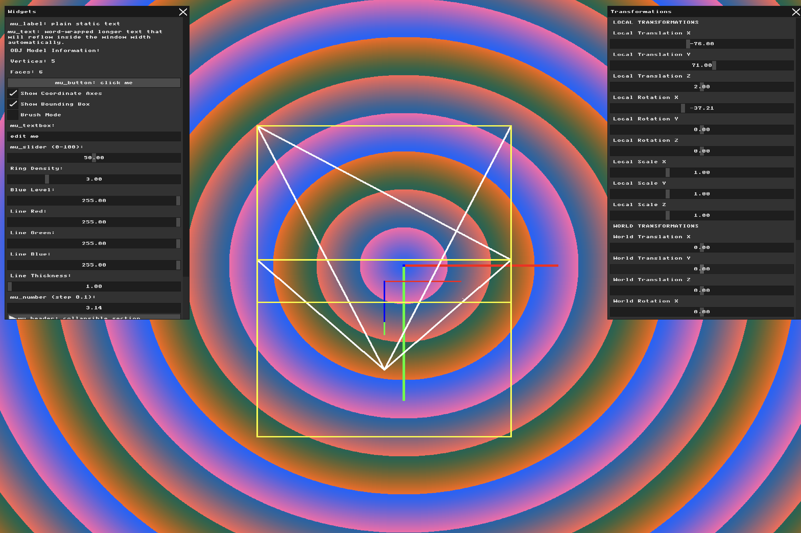

# Assignment: Virtual Cameras and Projections

## Overview

In Assignment 2, you successfully loaded a 3D model, applied mathematical transformations, and orthographically flattened it to the screen. In this assignment, we will implement a proper virtual camera system. You will explore the View matrix, replace your basic orthographic projection with a true Perspective projection, and calculate geometric normals to prepare our models for lighting.

### Part 1: Coordinate Frames and Bounding Boxes

##### Task 1

**My answer:** 
Firstly I created checkboxes for the axes and the bounding box so the user could turn them off and on easily: 
```
//variables for hw3 task 1
static int show_axes = 1;
static int show_bounding_box = 1;

  // checkbox
mu_layout_row(ctx, 1, w1, 0);
mu_checkbox(ctx, "Show Coordinate Axes", &show_axes);
mu_checkbox(ctx, "Show Bounding Box", &show_bounding_box);
```

Then I begun by building the axes. I started with the easy set of axes first. The easiest are the world axes, hence they are only dependent on our screen and not the object itself that always transforms.
Below is the code for the world axes:
```
//---------  World coordinate axes ----------------


    if (show_axes) {// if the checkbox true

        float axis_length = 300.0f;

        glm::vec4 origin(0.0f, 0.0f, 0.0f, 1.0f);// World origin

        // End points of the three world axes
        glm::vec4 x_axis(axis_length, 0.0f, 0.0f, 1.0f);
        glm::vec4 y_axis(0.0f, axis_length, 0.0f, 1.0f);
        glm::vec4 z_axis(0.0f, 0.0f, axis_length, 1.0f);

        // Move world coordinates to screen coordinates
        int ox = (int)(origin.x + WIDTH / 2.0f);
        int oy = (int)(origin.y + HEIGHT / 2.0f);

        int xx = (int)(x_axis.x + WIDTH / 2.0f);
        int xy = (int)(x_axis.y + HEIGHT / 2.0f);

        int yx = (int)(y_axis.x + WIDTH / 2.0f);
        int yy = (int)(y_axis.y + HEIGHT / 2.0f);

        int zx = (int)(z_axis.x + WIDTH / 2.0f);
        int zy = (int)(z_axis.y + HEIGHT / 2.0f);

    // drawing the axes
        draw_line(ox, oy, xx, xy,MFB_RGB(255, 0, 0), 4);
        draw_line(ox, oy, yx, yy,MFB_RGB(0, 255, 0), 4);
        draw_line(ox, oy, zx, zy,MFB_RGB(0, 0, 255), 4);
    }
```
As we see in the code, all I did was set the length of axis, set the origin vector and make all of the axises the origin vector + axis length in the corresponding parameter to the axis (x or y or z). Then those points are moved to the screen coordinated and later on we draw 3 lines from origin to the edges of the axis that we made by adding to the origin.

Then I implemented the local axes, by using the final matrix from previous assignment so the axes could transform just like the object.
Below is the code for the local axes:
```
// ----------local coordinate axes-----------

if (show_axes) {

    float local_axis_length = 300.0f;

    // Local origin and axis endpoints
    glm::vec4 local_origin =final_matrix * glm::vec4(0.0f, 0.0f, 0.0f, 1.0f);
    glm::vec4 local_x =final_matrix * glm::vec4(local_axis_length, 0.0f, 0.0f, 1.0f);
    glm::vec4 local_y =final_matrix * glm::vec4(0.0f, local_axis_length, 0.0f, 1.0f);
    glm::vec4 local_z =final_matrix * glm::vec4(0.0f, 0.0f, local_axis_length, 1.0f);

    // Orthographic projection
    int ox = (int)(local_origin.x + WIDTH / 2.0f);
    int oy = (int)(local_origin.y + HEIGHT / 2.0f);

    int xx = (int)(local_x.x + WIDTH / 2.0f);
    int xy = (int)(local_x.y + HEIGHT / 2.0f);

    int yx = (int)(local_y.x + WIDTH / 2.0f);
    int yy = (int)(local_y.y + HEIGHT / 2.0f);

    int zx = (int)(local_z.x + WIDTH / 2.0f);
    int zy = (int)(local_z.y + HEIGHT / 2.0f);

    draw_line(ox, oy, xx, xy,MFB_RGB(255, 0, 0), 2);
    draw_line(ox, oy, yx, yy,MFB_RGB(0, 255, 0), 2);
    draw_line(ox, oy, zx, zy,MFB_RGB(0, 0, 255), 2);
}

```
The logic in this code is the same as in the previous, but the only difference is that all of the points (origin and ends of axis) are multiplied by the transformation matrix, so they match the transformation of the object.

The second step was to create the bounding box.
Firstly I find the bounding box struct of the obj as we did in the previous assignment:
```
// HW3 Part 1: bounding box of the normalized model
BoundingBox normalized_box;

if (!normalized_vertices.empty()) {
    normalized_box = find_bounding_box(normalized_vertices);
}
```
Afterwards we build the box itself by finding its corners by listing all of the combinations of coordinates in the bounding box struct (which is 2^3 cause ever axis has only min and max value). Then we find all of the edges that connect this box and using the final matrix transform the corners so they match the object and finally draw the edges.
```
//------------Bounding Box---------------------------
if (show_bounding_box && !normalized_vertices.empty()) {

    // Create the 8 corners of the bounding box
    glm::vec3 corners[8] = {

        // Back side
        glm::vec3(normalized_box.min.x, normalized_box.min.y, normalized_box.min.z),
        glm::vec3(normalized_box.max.x, normalized_box.min.y, normalized_box.min.z),
        glm::vec3(normalized_box.max.x, normalized_box.max.y, normalized_box.min.z),
        glm::vec3(normalized_box.min.x, normalized_box.max.y, normalized_box.min.z),

        // Front side
        glm::vec3(normalized_box.min.x, normalized_box.min.y, normalized_box.max.z),
        glm::vec3(normalized_box.max.x, normalized_box.min.y, normalized_box.max.z),
        glm::vec3(normalized_box.max.x, normalized_box.max.y, normalized_box.max.z),
        glm::vec3(normalized_box.min.x, normalized_box.max.y, normalized_box.max.z)
    };

    // The 12 edges connecting the corners
    int edges[12][2] = {
        {0, 1}, {1, 2}, {2, 3}, {3, 0},
        {4, 5}, {5, 6}, {6, 7}, {7, 4},
        {0, 4}, {1, 5}, {2, 6}, {3, 7}
    };

    // Transform all corners using the same matrix as the model
    glm::vec4 transformed_corners[8];

    for (int i = 0; i < 8; i++) {
        transformed_corners[i] =
            final_matrix * glm::vec4(corners[i], 1.0f);
    }

    // Draw all 12 edges
    for (int i = 0; i < 12; i++) {

        glm::vec4 p0 = transformed_corners[edges[i][0]];
        glm::vec4 p1 = transformed_corners[edges[i][1]];

        // Orthographic projection
        int x0 = (int)(p0.x + WIDTH / 2.0f);
        int y0 = (int)(p0.y + HEIGHT / 2.0f);

        int x1 = (int)(p1.x + WIDTH / 2.0f);
        int y1 = (int)(p1.y + HEIGHT / 2.0f);

        draw_line(x0, y0,x1, y1,MFB_RGB(255, 255, 0),2);
    }
}
```
result: 


### Part 2: The Virtual Camera (View Matrix)

##### Task 2

**My answer:**

I started making the camera by creating the camera structure according to the instructions:
```
struct Camera {
    glm::vec3 position;
    glm::vec3 rotation;
};

static Camera camera = {//new camera
    glm::vec3(0.0f, 0.0f, 0.0f),
    glm::vec3(0.0f, 0.0f, 0.0f)
};
```
Then I added the sliders for position and rotation of the camera on all axes in the GUI:
```
// -------- camera --------

mu_layout_row(ctx, 1, wt, 0);
mu_label(ctx, "CAMERA");

mu_label(ctx, "Camera Position X");//position sliders in range -500 to 500
mu_slider(ctx, &camera.position.x, -500.0f, 500.0f);
mu_label(ctx, "Camera Position Y");
mu_slider(ctx, &camera.position.y, -500.0f, 500.0f);
mu_label(ctx, "Camera Position Z");
mu_slider(ctx, &camera.position.z, -500.0f, 500.0f);

mu_label(ctx, "Camera Rotation X");//rotation sliders in range -180 to 180
mu_slider(ctx, &camera.rotation.x, -180.0f, 180.0f);
mu_label(ctx, "Camera Rotation Y");
mu_slider(ctx, &camera.rotation.y, -180.0f, 180.0f);
mu_label(ctx, "Camera Rotation Z");
mu_slider(ctx, &camera.rotation.z, -180.0f, 180.0f);
```
Afterwards I constructed the view matrix:
```
// ----------------------View Matrix-----------------------

// Camera translation must be inverted
    glm::mat4 view_translation = glm::translate(glm::mat4(1.0f),-camera.position);

// Camera rotation must also be inverted
    glm::mat4 view_rotation = glm::mat4(1.0f);

    view_rotation = glm::rotate(view_rotation,glm::radians(-camera.rotation.z),glm::vec3(0.0f, 0.0f, 1.0f));
    view_rotation = glm::rotate(view_rotation,glm::radians(-camera.rotation.y),glm::vec3(0.0f, 1.0f, 0.0f));
    view_rotation = glm::rotate(view_rotation,glm::radians(-camera.rotation.x),glm::vec3(1.0f, 0.0f, 0.0f));

    glm::mat4 view_matrix =view_rotation * view_translation;

```
As it is said in the task background the view matrix is supposed to inverse everything that we do on the sliders. Therefore, when building it we need to reverse the translation and the rotation. We reverse the translation adding - in front of the slider value, we do so because if we move something right for example it would be adding positive value to axis x, so the opposite intervention would be walking the same value in the opposite direction from the origin which has negative values, and it is the same for every axis.
While for reversing the rotation matrix we need to simply insert the same value but negative due to the R^-1(0)=R(-0) equation from linear algebra.

Now to insure that the view matrix affects everything, I multiplied the calculations of axises, module vertices and bounding box.

result:

**Full demonstration:** [demo Video](https://youtu.be/mjYb7NykRmg)

### Part 3: Perspective Projection

##### Background: The View Frustum and Perspective Divide

Orthographic projection (dropping the Z coordinate) makes architectural drafting easy, but it lacks depth—objects far away look the same size as objects close up.

A **Perspective Projection** maps a 3D truncated pyramid (the *frustum*) into a standardized 3D cube (Normalized Device Coordinates). It achieves the illusion of depth through the **Perspective Divide**: dividing the $X$ and $Y$ coordinates by the vertex's distance from the camera ($Z$ or $W$ in homogeneous coordinates). The further away a vertex is, the more its $X$ and $Y$ values are squashed toward the center of the screen.

##### Task 3

Use GLM (or derive the math yourself) to construct a Perspective Projection matrix. You will need to define a Field of View (FOV), an aspect ratio (based on your window size), and Near/Far clipping planes. Replace your orthographic projection with this new matrix. Add a UI button to toggle between Orthographic and Perspective modes. Load a mesh, move the camera away from it, and ensure the difference between the two projections is clearly visible.

**My answer:**

I started off by adding the projection mode to my program it will later be in a form of checkbox as we did in task 1:

```
static int perspective_mode = 0;
```
Then I moved on to making the perspective matrix, by using the glm function that is specifically made for that:
```
float fov = 60.0f;
float aspect_ratio = (float)WIDTH / (float)HEIGHT;
float near_plane = 0.1f;
float far_plane = 5000.0f;

glm::mat4 perspective_matrix = glm::perspective(glm::radians(fov),aspect_ratio,near_plane,far_plane);
```
In this code there are four parameters: field of view (FOV), aspect ratio, near clipping plane, and far clipping plane. The FOV was set to 60 degrees to define the vertical viewing angle of the camera. The aspect ratio was calculated as the window width divided by its height (1600/1200), ensuring that the rendered model keeps the correct proportions. The near plane was set to 0.1 and the far plane to 5000, defining the visible depth range of the camera. 


### Part 4: Calculating Normals

##### Background: Which way is up?

To eventually calculate how light hits our object, we need to know which direction every polygon is facing. This direction is represented by a 3D unit vector called a **Normal**.

* A **Face Normal** is a single vector pointing perpendicular to the surface of a triangle.

* A **Vertex Normal** is a vector assigned to a vertex, usually calculated by averaging the face normals of all triangles sharing that vertex. This allows for smooth shading across jagged geometry.

##### Task

Write an algorithm to compute both the Face Normals and Vertex Normals for your loaded mesh. Use the cross product of the triangle's edges to find the face normal.
To verify your math is correct, implement a "Draw Normals" debug toggle in your UI. When enabled, use your `draw_line` function to draw short line segments pointing outward from the center of each face (for face normals) and from each vertex (for vertex normals). Make sure they transform correctly when you rotate the model!


