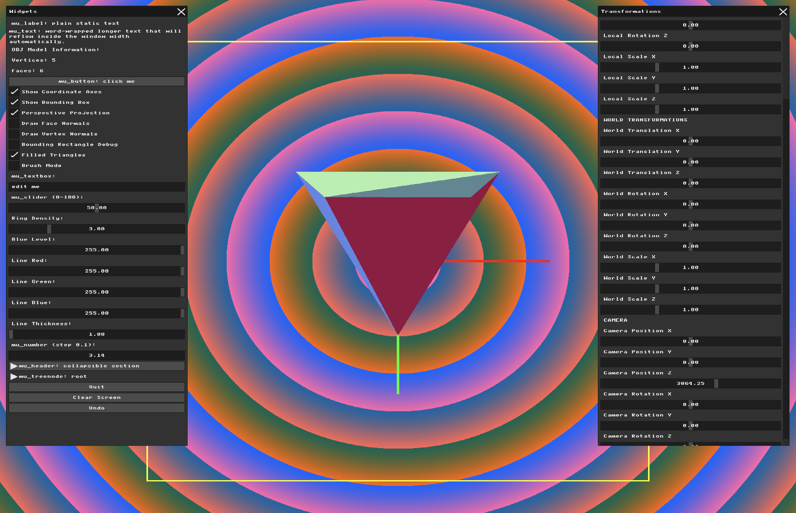

# Assignment: Triangle Rasterization and Depth Buffering

## Overview

Up to this point, your models have been rendered as transparent wireframes. In this assignment, we will finally create solid geometry. You will write a software rasterizer capable of filling 2D triangles with solid colors. Furthermore, you will solve the critical "visibility problem"—ensuring that geometry in the front correctly obscures geometry in the back—by implementing a Z-Buffer.

### Part 1: Bounding Box Rasterization (Debugging)

##### Background: The Rasterization Concept

##### Task 1 

**My answer:**

First, I added a new variable called show_bounding_rectangles and a checkbox to the GUI using mu_checkbox(). This allows the user to switch between the original wireframe rendering and the new bounding rectangle debug mode without changing the code.

```
static int show_bounding_rectangles = 0;
mu_checkbox(ctx, "Bounding Rectangle Debug", &show_bounding_rectangles);
```
Next, I created the draw_filled_rectangle() function, which takes the minimum and maximum X and Y coordinates of a rectangle. Before drawing, the coordinates are limited to the screen boundaries using std::min() and std::max(). This prevents the program from trying to draw pixels outside the framebuffer. Afterwords it generates a random color for the rectangles. And then finally it goes via 2 for loops over all of the pixels in the rectangles and colored them with the selected color.

```
void draw_filled_rectangle(int x_min, int y_min, int x_max, int y_max) {

    // Keep rectangle inside the screen
    x_min = std::max(0, x_min);
    y_min = std::max(0, y_min);

    x_max = std::min(WIDTH - 1, x_max);
    y_max = std::min(HEIGHT - 1, y_max);
            
    //random color choice
    uint8_t r = rand() % 256;
    uint8_t g = rand() % 256;
    uint8_t b = rand() % 256;
    uint32_t color = MFB_RGB(r, g, b);

    // Fill every pixel inside the rectangle
    for (int y = y_min; y <= y_max; y++) {
        for (int x = x_min; x <= x_max; x++) {
            g_buffer[y * WIDTH + x] = color;
        }
    }
}
```
For the checkbox to work I added a condition to check if it is marked or not. If it is marked the program uses the three projected screen coordinates of the triangle: (x0, y0), (x1, y1), and (x2, y2). Using std::min() and std::max(), it finds the smallest and largest X and Y values. These four values define the 2D bounding rectangle that contains the entire projected triangle. The coordinates are then passed to draw_filled_rectangle().

```
if (show_bounding_rectangles) {

    // Find minimum and maximum screen coordinates
    int x_min = std::min(x0, std::min(x1, x2));
    int x_max = std::max(x0, std::max(x1, x2));

    int y_min = std::min(y0, std::min(y1, y2));
    int y_max = std::max(y0, std::max(y1, y2));

    // Fill the triangle's bounding rectangle
    draw_filled_rectangle(
        x_min, y_min,
        x_max, y_max
    );

} else {

    // Original wireframe rendering
    draw_line(x0, y0, x1, y1, MFB_RGB(255, 255, 255), 2);
    draw_line(x1, y1, x2, y2, MFB_RGB(255, 255, 255), 2);
    draw_line(x2, y2, x0, y0, MFB_RGB(255, 255, 255), 2);
}
```
result: 


### Part 2: Triangle Filling Algorithms

##### Background: Inside the Triangle

##### Task 2

**My answer:**

First, I added a new variable called show_filled_triangles and a checkbox to the GUI using mu_checkbox(), just like what we did in the previous task.

```
static int show_filled_triangles = 0;
mu_checkbox(ctx, "Filled Triangles", &show_filled_triangles);
```
Next, I created the draw_filled_triangle() function:
```
// fill triangle using barycentric coordinates
void draw_filled_triangle(int x0, int y0,int x1, int y1,int x2, int y2, uint32_t color) {

    // find the bounding rectangle
    int x_min = std::min(x0, std::min(x1, x2));
    int x_max = std::max(x0, std::max(x1, x2));

    int y_min = std::min(y0, std::min(y1, y2));
    int y_max = std::max(y0, std::max(y1, y2));

    // keep coordinates inside the screen
    x_min = std::max(0, x_min);
    x_max = std::min(WIDTH - 1, x_max);

    y_min = std::max(0, y_min);
    y_max = std::min(HEIGHT - 1, y_max);

    // calculate denominator
    float denominator = (float)((y1 - y2) * (x0 - x2) + (x2 - x1) * (y0 - y2));

    // avoid division by zero
    if (denominator == 0.0f) {
        return;
    }

    // check every pixel inside the bounding rectangle
    for (int y = y_min; y <= y_max; y++) {
        for (int x = x_min; x <= x_max; x++) {

            // calculate barycentric coordinates
            float alpha = ((y1 - y2) * (x - x2) + (x2 - x1) * (y - y2)) / denominator;
            float beta = ((y2 - y0) * (x - x2) + (x0 - x2) * (y - y2)) / denominator;
            float gamma = 1.0f - alpha - beta;

            // check whether pixel is inside triangle
            if (alpha >= 0.0f && beta >= 0.0f && gamma >= 0.0f) {

                g_buffer[y * WIDTH + x] = color;
            }
        }
    }
}
```
This function takes the corners of a triangle and a random color as an input. Because all we want this algorithm to do is take a bounding rectangle and for every point decide if it is inside of our triangle or not, we have to find the bounding rectangle first, just like in the previous task and make sure that coordinates are inside the screen. Later on The denominator is calculated using the three triangle vertices and represents twice the signed area of the triangle. We use it to divide the barycentric numerators and convert them into weights relative to the whole triangle (alpha, beta, gamma). Since we divide by the denominator of course it is necessary to avoid the 0 case.

Then we jump into the main event which is the loop that checks whether the pixel is inside or outside the triangle. For that we need to calculate the barycentric weights. Since the three weights must add up to 1, we can replace gamma with `1 - alpha - beta` and separate the equation into X and Y coordinates. This gives us two equations with two unknowns, alpha and beta. By solving these equations using algebra, we get the formulas used in the code that we then divide by the denominator. 

Later our algorithm considers a pixel inside the triangle when all three barycentric weights are nonnegative because the weights describe the pixel as a weighted average of the triangle's vertices. Since the weights always add up to 1, positive weights mean that the point is located within the area formed by the three vertices. Each weight also represents a signed area ratio, so when a point moves outside the triangle across an edge, one of the weights becomes negative. Therefore, by checking that alpha, beta, and gamma are all greater than or equal to zero, we can determine whether the pixel is inside the triangle or on one of its edges.

And after determining whether the pixel is in or out of triangle we color it with the inputed color.

```
if (show_filled_triangles) {
             //random color choice
            uint8_t r = rand() % 256;
            uint8_t g = rand() % 256;
            uint8_t b = rand() % 256;
            uint32_t color = MFB_RGB(r, g, b);
            
            draw_filled_triangle(x0, y0,x1, y1,x2, y2, color);}
```
The final important change is that in the rendering loop I added an if for the case of filled triangles if we check the corresponding checkbox. 

result: 



### Part 3: The Z-Buffer Algorithm

##### Background: Solving the Visibility Problem

To ensure depth is respected at a per-pixel level, graphics hardware uses a **Z-buffer** (or Depth Buffer).
This is a second block of memory identically sized to your color `g_buffer`, but instead of storing ARGB colors, it stores a single floating-point value representing the distance (depth) from the camera to the closest pixel drawn so far. Before coloring a pixel, you check the Z-buffer. If the new pixel is closer to the camera than the value currently in the Z-buffer, you overwrite the color *and* update the Z-buffer. If it is further away, you simply discard it.

##### Task 3

**My answer:**

First, I created a new float array called `z_buffer` with the same dimensions as the color buffer to store depths. This allows me to keep track of which surface is closer to the camera when multiple triangles overlap on the screen. I also added the `show_z_buffer` variable, which I use later to control the depth visualization mode checkbox.

```
static float z_buffer[WIDTH * HEIGHT];
static int show_z_buffer = 0;
```
At the beginning of every frame, I initialize all values in the Z-buffer to infinity using `std::fill`. We need to reset the Z-buffer every frame because the model or camera can move, and the depth information from the previous frame is no longer valid.

```
// Clear Z-buffer once per frame
std::fill(z_buffer,z_buffer + WIDTH * HEIGHT,std::numeric_limits<float>::infinity());
```
Next, I needed the depth of each triangle vertex. I already had the transformed vertices from the previous tasks, so I used their Z coordinates after applying the model and view matrices. I multiplied the Z values by -1 because the camera looks along the negative Z direction, and I wanted smaller positive depth values to represent points closer to the camera. And I also saved these values as `z0`, `z1`, and `z2` so I could use them during triangle rasterization.

```
glm::vec4 v0 = view_matrix * final_matrix * glm::vec4(normalized_vertices[face.v0], 1.0f);
glm::vec4 v1 = view_matrix * final_matrix * glm::vec4(normalized_vertices[face.v1], 1.0f);
glm::vec4 v2 = view_matrix * final_matrix * glm::vec4(normalized_vertices[face.v2], 1.0f);

// Depth of each vertex
float z0 = -v0.z;
float z1 = -v1.z;
float z2 = -v2.z;
```
I modified my existing `draw_filled_triangle` function to receive the Z coordinate of each vertex in addition to its X and Y coordinates. Previously, we only needed X and Y to determine which pixels were inside the triangle. Now we also need Z to calculate the depth of those pixels. I updated the function call in the rendering loop to pass all three depth values. I also made sure the triangle-filling function runs when either the filled triangle mode or Z-buffer visualization mode is enabled.

```
if (show_filled_triangles || show_z_buffer) {
    draw_filled_triangle(x0, y0, z0,x1, y1, z1,x2, y2, z2,triangle_colors[i]);
}
```
After checking whether a pixel is inside the triangle using barycentric coordinates, I calculate its Z-depth. I reuse the alpha, beta, and gamma values from Task 2 because they tell me how much each vertex contributes to the current pixel. By multiplying each vertex's depth by its corresponding barycentric weight and adding the results, I get an interpolated depth value for that pixel. This lets me calculate depth across the entire triangle instead of using one depth value for the whole face.

```
float alpha = ((y1 - y2) * (x - x2) + (x2 - x1) * (y - y2)) / denominator;
float beta = ((y2 - y0) * (x - x2) + (x0 - x2) * (y - y2)) / denominator;
float gamma = 1.0f - alpha - beta;

if (alpha >= 0.0f && beta >= 0.0f && gamma >= 0.0f) {
    float z = alpha * z0 + beta * z1 + gamma * z2;
}
```
The next step was implementing the depth test. For each pixel inside a triangle, I calculate its position in the buffer using `y * WIDTH + x`. Then I compare the new interpolated depth with the depth already stored in the Z-buffer. If the new depth is smaller, it means the new pixel is closer to the camera, so I update both the Z-buffer and the color buffer. Otherwise, I ignore the pixel because another surface is already closer. This solves the overlapping triangle problem from Task 2, where triangles could appear in front of each other simply because of the order in which they were drawn.

```
int index = y * WIDTH + x;

if (z < z_buffer[index]) {
    z_buffer[index] = z;
    g_buffer[index] = color;
}
```
To visualize the Z-buffer, I first needed to find the smallest and largest depth values in the scene. I loop through the Z-buffer and only consider finite values, because pixels that were never covered by a triangle still contain infinity. Finding the minimum and maximum depth allows me to determine the visible depth range and use it to convert the values into grayscale colors.

```
float min_depth = std::numeric_limits<float>::infinity();
float max_depth = -std::numeric_limits<float>::infinity();

for (int i = 0; i < WIDTH * HEIGHT; i++) {
    if (std::isfinite(z_buffer[i])) {
        min_depth = std::min(min_depth, z_buffer[i]);
        max_depth = std::max(max_depth, z_buffer[i]);
    }
}
```
Next, I normalize the depth values to a range between 0 and 1. I do this by subtracting the minimum depth from the current depth and dividing by the difference between the maximum and minimum. I also check that the range is greater than zero to avoid division by zero when all visible pixels have the same depth.

```
float range = max_depth - min_depth;
float normalized = 0.0f;

if (range > 0.0f) {
    normalized = (z_buffer[i] - min_depth) / range;
}
```
Finally, I convert the normalized depth into a grayscale value by multiplying it by 255. I use this value for all three RGB components, so each pixel becomes a shade of gray. In my implementation, closer pixels are darker and farther pixels are lighter. Pixels that have no depth value are displayed in black. 

```
if (!std::isfinite(z_buffer[i])) {
    g_buffer[i] = MFB_RGB(0, 0, 0);
    continue;
}

uint8_t gray = (uint8_t)(normalized * 255.0f);
g_buffer[i] = MFB_RGB(gray, gray, gray);
```
Additionally I added a checkbox called `Show Z-Buffer` to the user interface. When the checkbox is enabled, the program calls `visualize_z_buffer()` and replaces the normal colors with grayscale depth values. When it is disabled, the program displays the normal color buffer. I placed the visualization call before the UI rendering so the controls remain visible in both modes.

```
mu_checkbox(ctx, "Show Z-Buffer", &show_z_buffer);
```
```
if (show_z_buffer) {
    visualize_z_buffer();
}

// UI Rendering
renderer.render(ctx, g_buffer);
```
result:

<table>
  <tr>
    <td align="center">
      
      <br>
      <b>Figure 1: Color Buffer</b>
    </td>
    <td align="center">
      
      <br>
      <b>Figure 2: Z-Buffer</b>
    </td>
  </tr>
</table>
