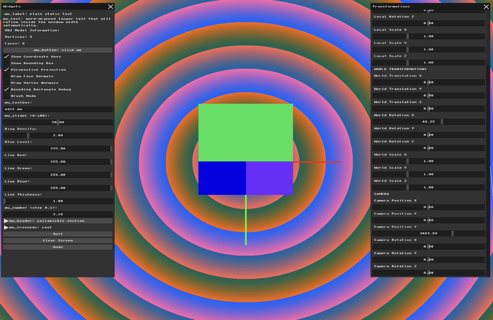

# Assignment: Triangle Rasterization and Depth Buffering

## Overview

Up to this point, your models have been rendered as transparent wireframes. In this assignment, we will finally create solid geometry. You will write a software rasterizer capable of filling 2D triangles with solid colors. Furthermore, you will solve the critical "visibility problem"—ensuring that geometry in the front correctly obscures geometry in the back—by implementing a Z-Buffer.

### Part 1: Bounding Box Rasterization (Debugging)

##### Background: The Rasterization Concept

##### Task 1 

**My answer:**

First, I added a new variable called show_bounding_rectangles and a checkbox to the GUI using mu_checkbox(). This allows the user to switch between the original wireframe rendering and the new bounding rectangle debug mode without changing the code.

```
static int show_bounding_rectangles = 0;
mu_checkbox(ctx, "Bounding Rectangle Debug", &show_bounding_rectangles);
```
Next, I created the draw_filled_rectangle() function, which takes the minimum and maximum X and Y coordinates of a rectangle. Before drawing, the coordinates are limited to the screen boundaries using std::min() and std::max(). This prevents the program from trying to draw pixels outside the framebuffer. Afterwords it generates a random color for the rectangles. And then finally it goes via 2 for loops over all of the pixels in the rectangles and colored them with the selected color.

```
void draw_filled_rectangle(int x_min, int y_min, int x_max, int y_max) {

    // Keep rectangle inside the screen
    x_min = std::max(0, x_min);
    y_min = std::max(0, y_min);

    x_max = std::min(WIDTH - 1, x_max);
    y_max = std::min(HEIGHT - 1, y_max);
            
    //random color choice
    uint8_t r = rand() % 256;
    uint8_t g = rand() % 256;
    uint8_t b = rand() % 256;
    uint32_t color = MFB_RGB(r, g, b);

    // Fill every pixel inside the rectangle
    for (int y = y_min; y <= y_max; y++) {
        for (int x = x_min; x <= x_max; x++) {
            g_buffer[y * WIDTH + x] = color;
        }
    }
}
```
For the checkbox to work I added a condition to check if it is marked or not. If it is marked the program uses the three projected screen coordinates of the triangle: (x0, y0), (x1, y1), and (x2, y2). Using std::min() and std::max(), it finds the smallest and largest X and Y values. These four values define the 2D bounding rectangle that contains the entire projected triangle. The coordinates are then passed to draw_filled_rectangle().

```
if (show_bounding_rectangles) {

    // Find minimum and maximum screen coordinates
    int x_min = std::min(x0, std::min(x1, x2));
    int x_max = std::max(x0, std::max(x1, x2));

    int y_min = std::min(y0, std::min(y1, y2));
    int y_max = std::max(y0, std::max(y1, y2));

    // Fill the triangle's bounding rectangle
    draw_filled_rectangle(
        x_min, y_min,
        x_max, y_max
    );

} else {

    // Original wireframe rendering
    draw_line(x0, y0, x1, y1, MFB_RGB(255, 255, 255), 2);
    draw_line(x1, y1, x2, y2, MFB_RGB(255, 255, 255), 2);
    draw_line(x2, y2, x0, y0, MFB_RGB(255, 255, 255), 2);
}
```
result: 



### Part 2: Triangle Filling Algorithms

##### Background: Inside the Triangle

To turn your bounding boxes into actual triangles, you must implement an inclusion test. In this assignment, you will use **Barycentric Coordinates**. This is an elegant mathematical coordinate system: for any pixel $(x, y)$ inside the bounding box, you calculate three weights $(\alpha, \beta, \gamma)$. If all three weights are between $0$ and $1$, the pixel is inside the triangle!

##### Task 2

Implement the Barycentric Coordinates algorithm to fill your triangles (it is highly recommended to use an AI assistant to help you explore and derive the math behind this coordinate system!). Update your loop from Part 1: for every pixel in the bounding box, calculate its barycentric weights to perform the inclusion test. If the pixel is inside, color it; if it is outside, skip it.

Assign a random color to every face in your mesh. When you render your scene, you should now see a solid, fully filled 3D object!

*Note the visual artifacts:* You will likely see triangles overlapping incorrectly. A triangle from the back of the model might be drawn *on top* of a triangle in the front simply because it was processed later in your loop (the Painter's Algorithm problem).

**My answer:**

First, I added a new variable called show_filled_triangles and a checkbox to the GUI using mu_checkbox(), just like what we did in the previous task.

```
static int show_filled_triangles = 0;
mu_checkbox(ctx, "Filled Triangles", &show_filled_triangles);
```
Next, I created the draw_filled_triangle() function:
```
// fill triangle using barycentric coordinates
void draw_filled_triangle(int x0, int y0,int x1, int y1,int x2, int y2, uint32_t color) {

    // find the bounding rectangle
    int x_min = std::min(x0, std::min(x1, x2));
    int x_max = std::max(x0, std::max(x1, x2));

    int y_min = std::min(y0, std::min(y1, y2));
    int y_max = std::max(y0, std::max(y1, y2));

    // keep coordinates inside the screen
    x_min = std::max(0, x_min);
    x_max = std::min(WIDTH - 1, x_max);

    y_min = std::max(0, y_min);
    y_max = std::min(HEIGHT - 1, y_max);

    // calculate denominator
    float denominator = (float)((y1 - y2) * (x0 - x2) + (x2 - x1) * (y0 - y2));

    // avoid division by zero
    if (denominator == 0.0f) {
        return;
    }

    // check every pixel inside the bounding rectangle
    for (int y = y_min; y <= y_max; y++) {
        for (int x = x_min; x <= x_max; x++) {

            // calculate barycentric coordinates
            float alpha = ((y1 - y2) * (x - x2) + (x2 - x1) * (y - y2)) / denominator;
            float beta = ((y2 - y0) * (x - x2) + (x0 - x2) * (y - y2)) / denominator;
            float gamma = 1.0f - alpha - beta;

            // check whether pixel is inside triangle
            if (alpha >= 0.0f && beta >= 0.0f && gamma >= 0.0f) {

                g_buffer[y * WIDTH + x] = color;
            }
        }
    }
}
```
This function takes the corners of a triangle and a random color as an input. Because all we want this algorithm to do is take a bounding rectangle and for every point decide if it is inside of our triangle or not, we have to find the bounding rectangle first, just like in the previous task and make sure that coordinates are inside the screen. Later on The denominator is calculated using the three triangle vertices and represents twice the signed area of the triangle. We use it to divide the barycentric numerators and convert them into weights relative to the whole triangle (alpha, beta, gamma). Since we divide by the denominator of course it is necessary to avoid the 0 case.

Then we jump into the main event which is the loop that checks whether the pixel is inside or outside the triangle. For that we need to calculate the barycentric weights. Since the three weights must add up to 1, we can replace gamma with `1 - alpha - beta` and separate the equation into X and Y coordinates. This gives us two equations with two unknowns, alpha and beta. By solving these equations using algebra, we get the formulas used in the code that we then divide by the denominator. 

Later our algorithm considers a pixel inside the triangle when all three barycentric weights are nonnegative because the weights describe the pixel as a weighted average of the triangle's vertices. Since the weights always add up to 1, positive weights mean that the point is located within the area formed by the three vertices. Each weight also represents a signed area ratio, so when a point moves outside the triangle across an edge, one of the weights becomes negative. Therefore, by checking that alpha, beta, and gamma are all greater than or equal to zero, we can determine whether the pixel is inside the triangle or on one of its edges.

And after determining whether the pixel is in or out of triangle we color it with the inputed color.

```
if (show_filled_triangles) {
             //random color choice
            uint8_t r = rand() % 256;
            uint8_t g = rand() % 256;
            uint8_t b = rand() % 256;
            uint32_t color = MFB_RGB(r, g, b);
            
            draw_filled_triangle(x0, y0,x1, y1,x2, y2, color);}
```
The final important change is that in the rendering loop I added an if for the case of filled triangles if we check the corresponding checkbox. 

result: 

### Part 3: The Z-Buffer Algorithm

##### Background: Solving the Visibility Problem

To ensure depth is respected at a per-pixel level, graphics hardware uses a **Z-buffer** (or Depth Buffer).
This is a second block of memory identically sized to your color `g_buffer`, but instead of storing ARGB colors, it stores a single floating-point value representing the distance (depth) from the camera to the closest pixel drawn so far. Before coloring a pixel, you check the Z-buffer. If the new pixel is closer to the camera than the value currently in the Z-buffer, you overwrite the color *and* update the Z-buffer. If it is further away, you simply discard it.

##### Task

Create a `float` array to serve as your Z-buffer. At the start of every frame, initialize all values to a very large number (representing infinity/the far clipping plane).

During your triangle rasterization loop, calculate the interpolated Z-depth for the current pixel using your Barycentric coordinates (this is simply $\alpha Z_1 + \beta Z_2 + \gamma Z_3$). Implement the depth test. Your overlapping triangle artifacts from Part 2 should instantly disappear, revealing a perfect, solid 3D model.

Finally, write a visualization mode: Map the raw floating-point values in your Z-buffer to grayscale colors and draw them directly to the screen. You should see a "depth map" of your scene, where closer pixels are darker (or lighter) than pixels further away. Include side-by-side screenshots of the Color Buffer and Z-Buffer in your report.

